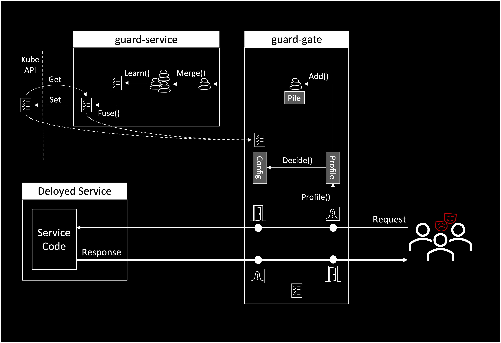

# Guard Architecture

Guard protects services deployed on Knative services and be extended to protect Kubernetes microservices. To protect a service, Guard deploys a [guard-gate](pkg/guard-gate) as a sidecar inside the service Pod. In Knative, [guard-gate](pkg/guard-gate) is deployed as a queue proxy extension using the queue proxy [qpoption](pkg/qpoption). When protecting a non-Knative service, Guard need to be deployed as a standalone sidecar.

Guard additionally uses a backend service to serve [guard-gate](pkg/guard-gate) instance. The backend service, [guard-service](cmd/guard-service) is deployed as a standalone service. It is important to note that [guard-gate](pkg/guard-gate) can continue to work normally even when [guard-service](cmd/guard-service) is unavailable. The availability of [guard-service](cmd/guard-service) does not affect Guard runtime services.

When [guard-gate](pkg/guard-gate)  initializes it fetches the service Guardian either from [guard-service](cmd/guard-service) or from KubeApi. For long running services, [guard-gate](pkg/guard-gate) periodically re-fetch the Guardian with any updates it may have.

The Guardian includes Guardian.Ctrl - a set of control instructions and a set of Configs: The ReqConfig, ReqDataConfig, RespConfig, RespDataConfig and PodConfig. Each Guardian.Config element include a set of micro-rules describing the expected behavior from a security standpoint.

    

As shown in the diagram, when a user sends a request to the deployed service, guard-gate profiles the request headers to produce ReqProfile and the body to produce ReqDataProfile. Similarly, when the service sends a response to the user, guard-gate profiles the response headers to produce RespProfile and the body to produce RespDataProfile. Further,  guard-gate periodically profiles the Pod to produce RodProfile.

Once a profile is produced, [guard-gate](pkg/guard-gate) uses the respective Config.Decide() to determine if the Profile meets the micro-rules stored inside the respective Config element. The decision made by the Config and Guardian.Ctrl determines what would teh gate-guard do next. See documentation about the Guardian Control for further details.

* guard-gate may decide to block the request or may decide to allow the request to let it pass.
* guard-gate may decide to add the profile to the pile or may decide not to add it.

Periodically, as show in the diagram, [guard-gate](pkg/guard-gate) sends the Pile to the [guard-service](cmd/guard-service) where it sis merged with the pile maintained by [guard-service](cmd/guard-service) - this merged pile include information from all instances of [guard-gate](pkg/guard-gate) that serve the same service - i.e. from all [guard-gate](pkg/guard-gate) instances of all service pods.

From time to time, [guard-service](cmd/guard-service) learns a new Guardian with all necessary Configs from the merged pile. This Guardian is merged with the Guardian that the [guard-service](cmd/guard-service) receives from KubeApi and the merged Guardian is stored back to KubeApi. This allows for gradual learning of Guardians per service.  

