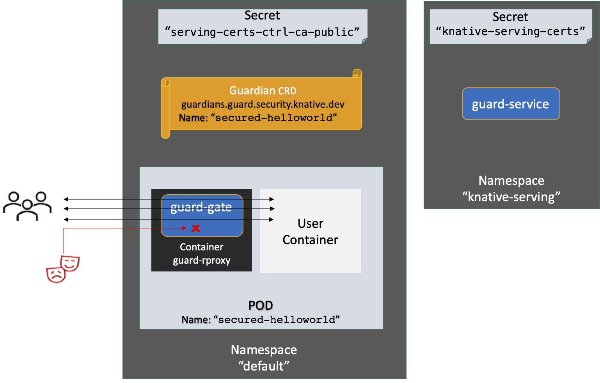
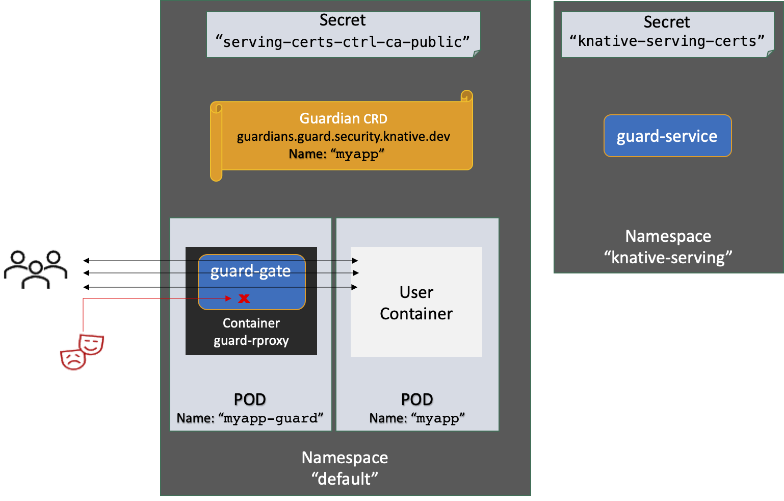

# Guard on Vanilla Kubernetes

For direct deployment of guard on Kubernetes, [guard-gate](./pkg/guard-gate/README.md) needs to be deployed per-service inside a reverse proxy. The reverse proxy needs to be configured to consume all ingress requests and forward it to the protected service. [guard-rproxy](./cmd/guard-rproxy/README.md) can be used as the guard reverse proxy.

The repository exemplifies the use of [guard-rproxy](./cmd/guard-rproxy/README.md) deployed as a sidecar to protect a "hello world" service - this is the recommended installation pattern of guard when deploying in vanilla Kubernetes - see the [helloworld example](#using-guard-rproxy-as-a-sidecar) below.

The repository also exemplifies the use of [guard-rproxy](./cmd/guard-rproxy/README.md) as a separate layer in front of a "hello world" service - see the [myapp example](#using-guard-rproxy-in-a-separate-pod) below.

## Before you use Vanilla Kubernetes

Most use cases for deploying twelve-factor app microservices on Kubernetes,are more easiaaly achivable using Knative. Guard is well integrated into Knative making it easier to deploy and use. The blog post ["Knative - An Opinionated Kubernetes"](https://davidhadas.wordpress.com/2022/08/29/knative-an-opinionated-kubernetes/) highlights why in many cases, Knative should be your preferred path for deploying web services over Kubernetes rather than deploying directly on vanilla Kubernetes.

Continue reading here if you prefer the usual (and a bit more rocky) Kubernetes path.

## Installing in Kind

See the [installation script](./hack/kind/deployKind.sh) for a quick deployment of a secured-hello pod on Kind.

The installation script installs guard components and two example services:

- The `secured-helloworld` pod demonstrates the recommended way to use [guard-rproxy](./cmd/guard-rproxy/README.md) as a sidecar protecting a user container that runs service logic.
- The `myapp-guard` and `myapp` pods demonstrates a less recommended way to use [guard-rproxy](./cmd/guard-rproxy/README.md) as a separate pod in front of a user pod that runs service logic.

### Installing guard-service

By default, [guard-service](cmd/guard-service/README.md) is installed in the `knative-serving` namespace. Therefore, [guard-rproxy](./cmd/guard-rproxy/README.md) will by default look for [guard-service](cmd/guard-service/README.md) in the url `"https://guard-service.knative-serving"`.

If you are using a different namespace, you need to setup [guard-rproxy](./cmd/guard-rproxy/README.md)'s GUARD_SERVICE_URL env variable to ensure it can access [guard-service](cmd/guard-service/README.md).

### Using guard-rproxy as a sidecar

This is the recommended way to protect services under vanilla Kubernetes.

<p align="center">
    
</p>

The diagram shows the installed resources after using the installation script. Note that `secured-helloworld` has two containers - the "User" container represents the service logic being deployed while "guard-rproxy" container is the [guard-rproxy](./cmd/guard-rproxy/README.md) protecting the service. Correspondingly, we set the protected container to not be exposed outside the pod.

```sh
kubectl get pods
NAME                                  READY   STATUS    RESTARTS   AGE
...
secured-helloworld-5c766cd664-m44cw   2/2     Running   0          11h

kubectl get deployment/secured-helloworld -o jsonpath='{.spec.template.spec.containers[*].name}'

helloworld guard-rproxy

kubectl get pods -n knative-serving
NAME                             READY   STATUS      RESTARTS   AGE
...
guard-service-6b6d5d9444-hzjtl   1/1     Running     0          12h
```

Once installed, try accessing the service using curl:

```sh
curl http://127.0.0.1:/hello
Hello World!
```

Note that guard learns the access patterns over time - wait until guard have created the guardian for your service. See the guardian crd related to `helloworld` using kubectl.

```sh
kubectl get guardians.guard.security.knative.dev

NAME                 AGE
...
secured-helloworld   3m32s
```

Now try a different pattern and notice the alert in the logs:

```sh
curl http://127.0.0.1:/hello?a=2
Hello World!

kubectl logs deployment/secured-helloworld guard-rproxy
...
info  SECURITY ALERT! Session ->[HttpRequest:[QueryString:[KeyVal:[Key a is not known,],],],]
...
```

Guard identified that a query string with a key 'a' was not inline with the guardian and reports this. If guard was set to be in a blocking mode, it would also block the request. By default, guard work in a non-blocking mode, so your new patterns result in alerts but are not blocked. Guard will learn the new pattern over time, trying to use the same pattern sometime later will not result in alert. In this default mode, guard can be used to detect any new patterns experienced by your service.

### Using guard rproxy in a separate pod

<p align="center">
    
</p>
The diagram shows the installed resources after using the installation script. Note that `myapp` represent the service logic being deployed while `myapp-guard` is the [guard-rproxy](./cmd/guard-rproxy/README.md) protecting the service. Correspondingly, we set `myapp` to not be exposed outside of the cluster - set it to only accept requests coming from `myapp-guard`.

```sh
kubectl get pods
NAME                                  READY   STATUS    RESTARTS   AGE
...
myapp-c546b6c59-2m4f5                 1/1     Running   0          13h
myapp-guard-864fb77854-gdz8j          1/1     Running   0          13h
```

Once installed, try accessing the service using curl:

```sh
curl http://127.0.0.1:/myapp
Hello World!
```

Note that guard learns the access patterns over time - wait until guard have created the guardian for your service. See the guardian crd related to `myapp` using kubectl.

```sh
kubectl get guardians.guard.security.knative.dev

NAME                 AGE
...
myapp-guard          22s
```

Now try a different pattern and notice the alert in the logs:

```sh
curl http://127.0.0.1:/myapp?a=2
Hello World!

kubectl logs deployment/myapp-guard
...
info  SECURITY ALERT! Session ->[HttpRequest:[QueryString:[KeyVal:[Key a is not known,],],],]
...
```

Guard identified that a query string with a key 'a' was not inline with the guardian and reports this. If guard was set to be in a blocking mode, it would also block the request. By default, guard work in a non-blocking mode, so your new patterns result in alerts but are not blocked. Guard will learn the new pattern over time, trying to use the same pattern sometime later will not result in alert. In this default mode, guard can be used to detect any new patterns experienced by your service.

## Production Environment

Guard internal communications use TLS by default. You can create the secrets used by guard by deploying the [create-knative-secrets](./cmd/create-knative-secrets/README.md) Job. This Job will create the secrets in the `knative-serving` namespace.

```sh
kubectl get pods -n knative-serving
NAME                            READY   STATUS      RESTARTS   AGE
...
create-knative-secrets-njdd4    0/1     Completed   0          2m12s

kubectl get secrets -n knative-serving

NAME                           TYPE     DATA   AGE
knative-serving-certs          Opaque   6      12h
serving-certs-ctrl-ca          Opaque   4      12h
```

After the secrets were created, you should copy the `knative-serving-certs` secret to any namespace where protected services are deployed. You may use [the `copyCerts` script] (./hack/copyCerts.sh) to ease your work. The Kind installation already use this script to copy the secrets to the default namespace.

```sh
kubectl get secrets

NAME                           TYPE     DATA   AGE
default-serving-certs          Opaque   6      11h
```

When using in production, it is necessary to ensure that:

- [guard-rproxy](./cmd/guard-rproxy/README.md) can verify the certificate of the [guard-service](cmd/guard-service/README.md) using the Ceertificate Authority public key. This id doen by mounting a secret that contains the public key to [guard-rproxy](./cmd/guard-rproxy/README.md). You can deploy [create-knative-secrets](./cmd/create-knative-secrets/README.md) as a Job to create the required secrets in the `knative-serving` namespace. Once created, you may copy the secret to any namespace where protected services are deployed. You may also use [the `copyCerts` script] (./hack/copyCerts.sh) to ease your work.

### Install  guard-service from source

```sh
kubectl apply -Rf ./config-production/resources/
export KO_DOCKER_REPO= \<your image repository\>

ko apply -f ./config/deploy/create-knative-secrets.yaml
ko apply -f ./config/deploy/guard-service.yaml
```

### Install guard-service from released images and yamls

```sh
kubectl apply -f https://raw.githubusercontent.com/knative-sandbox/security-guard/release-0.6/config/resources/gateAccount.yaml
kubectl apply -f https://raw.githubusercontent.com/knative-sandbox/security-guard/release-0.6/config/resources/serviceAccount.yaml
kubectl apply -f https://raw.githubusercontent.com/knative-sandbox/security-guard/release-0.6/config/resources/guardiansCrd.yaml

kubectl apply -f https://github.com/knative-sandbox/security-guard/releases/download/v0.6.0/create-knative-secrets.yaml
kubectl apply -f https://github.com/knative-sandbox/security-guard/releases/download/v0.6.0/guard-service.yaml
```

## Deploying a pod with a Security-Guard sidecar

First make sure to copy the Cetificate Authority public key secret to your namespace.

```sh
./hack/copyCerts.sh \<namespace-of-your-app\>
```

Next add the [guard-rproxy](./cmd/guard-rproxy/README.md) container to your service. Make sure only the [guard-rproxy](./cmd/guard-rproxy/README.md) container is exposed outside the container:

```sh
apiVersion: apps/v1
kind: Deployment
...
spec:
  ...
  template:
    ...
    spec:
      volumes:
      - name: certificate-volume
        secret:
          secretName: default-serving-certs
          optional: true
      - name: guard-token-volume
        projected:
          defaultMode: 420
          sources:
          - serviceAccountToken:
              audience: guard-service
              expirationSeconds: 3600
              path: guard-service
      serviceAccountName: guardian-reader
      containers:
      ...
      - name: guard-rproxy
        image: gcr.io/knative-releases/knative.dev/security-guard/cmd/guard-rproxy
        ports:
        - containerPort: 22000
        volumeMounts:
        - mountPath: /var/run/secrets/tokens
          name: guard-token-volume
          readOnly:  true
        - mountPath: /var/lib/knative/certs
          name: certificate-volume
          readOnly:  true
        env:
        - name: SERVICE_NAME
          value: <A unique name of the service>
        - name: PROTECTED_SERVICE
          value: <The :port or url of the protected service container inside the pod, default is :8080>
        - name: LOG_LEVEL
          value: "info"
        - name: NAMESPACE
          valueFrom:
            fieldRef:
              fieldPath: metadata.namespace

---
apiVersion: v1
kind: Service
...
spec:
  ...
  ports:
    - protocol: TCP
      port: 22000
```
