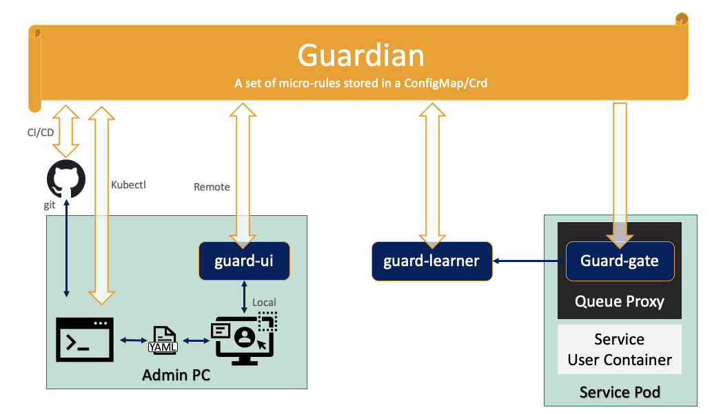

# Guard

## Why Do We Need Guard?

User containers deployed by Knative may include vulnerabilities, may be misconfigured and may include malicious code. The source of such vulnerabilities, misconfigurations or malicious code may be the DevOps team, a dependency or a hacker that has successfully penetrated any of the support systems (image repository, ci/cd, Knative, Kube, the DevOps team development systems etc. etc. etc.) or one of the services used by the user container. Any such security issue may enable an attacker to use the user container for other purposes than its original intention (e.g. steal data, attack others, spread, contact a C&C, Crypto mining, etc.)

Users of Knative require the means to block (and/or get an alert about) an attempt to exploit a vulnerability or misconfiguration, embedded in a user container. Also, users of Knative require the means to establish situational awareness about container running potentially malicious code and be offered ways to respond once they discover that the user containers are being exploited by attackers.

## How Does Guard Help Secure Knative Services

The core component of Guard is the [guard-gate](https:pkg/guard-gate) which can be used to extend Knative Queue Proxy. [guard-gate](https:pkg/guard-gate) monitors and potentially blocks requests and/or responses to Knative services based on a per-service security configuration.

The per service security configuration is stored in a **"Guardian"** object. **Guardian** maintains a set of micro-rules that enable a fine grain filtering, performed against each value delivered to/from the service.
By using the micro-rules, [guard-gate](https:pkg/guard-gate) can identify the delivery of exploits targeting vulnerabilities embedded as part of the service or its dependencies.

When [guard-gate](https:pkg/guard-gate) and a proper set of micro-rules are used, offenders will typically be required to build dedicated delivery mechanisms in order to explore options for detecting and exploiting service vulnerabilities. This lengthy process may need to be repeated for each service, as each service maintains a different set of micro-rules. As a result, an offender will not be able to use common statistical attack patterns.  

Users of [guard-gate](https:pkg/guard-gate) gain Situational Awareness both thanks to alerts about out-of-pattern request/responses, and by the identification of security indicators that the service is misused. Such indicators include longer than usual  service times and the list of external IP addresses approached by the service.

Beyond, Situational Awareness, [guard-gate](https:pkg/guard-gate) enables blocking out-of-pattern behaviors and the ability to react to potential attacks and/or to on-going attacks by introducing a fine-tune configurable security gate in front of the service.

Overall, the solution offers both visibility into the security of the service, and the ability to monitor/block both known patterns and unknown patterns (using a zero-day exploits).

    

## Solution Components

This project adds:

1. [guard-gate](https:pkg/guard-gate) - the workload security gate that is located in front of each service
1. A **Guardian**  - an object implemented as either a CRD or a Configmap maintaining a set of micro-rules per service
1. [guard-learner](https:cmd/guard-learner) - a learner service to auto learn the micro-rules stored in the **Guardian**
1. [guard-ui](https:cmd/guard-ui) - a user interface web app to simplify manual configuration of micro-rules

In addition, the project adds:

1. [qpoption](https:pkg/qpoption) - a package to enable using [guard-gate](https:pkg/guard-gate) with Knative Queue Proxy Option
1. [test-gate](https:pkg/test-gate) - a package to enable testing Knative Queue Proxy Options named
1. [pluginterfaces](https:pkg/pluginterfaces) - a base package to enable registration and interfacing security gates

## Guard Gate

[guard-gate](https:pkg/guard-gate) can be loaded as a knative queue proxy option using [qpoption](https:pkg/qpoption)

Once loaded, it monitors the proxied requests and responses and the pod network.

Note that [guard-gate](https:pkg/guard-gate) can also be used for more generic Kubernetes use cases by loading:

- As a standalone reverse proxy, see for example: [guard-rproxy](https://github.com/IBM/workload-security-guard/tree/main/cmd/guard-rproxy)
- As an extension to any go proxy, for example by using: [rtplugs](https://github.com/IBM/go-security-plugs/tree/main/rtplugs).

## Guardian

[guard-gate](https:pkg/guard-gate) uses **Guardian** - a set of micro-rules that define the expected behavior of the service.

The **Guardian** object maintains the following configuration parameters:

1. A control object which defines the working mode of Guard in relation to the service
1. A learned set of micro-rules updated by [guard-learner](https:cmd/guard-learner)
1. A manually configured set of micro-rules that can be updated using `kubectl` or using [guard-ui](https:cmd/guard-ui)  

Each service has its own respective **Guardian**. New services may use a default **Guardian** for the Kubernetes namespace or may use the default Guard **Guardian**. The following procedure describes how the **Guardian** for a service is found:

- **Guardian** may reside in a CRD (guardians.wsecurity.ibmresearch.com) under the name '\<servicename\>.\<namespace\>' or in a configmap under the name 'guardian-\<servicename\>'.
- If a **Guardian** is not found, [guard-gate](https:pkg/guard-gate) will look for a namespace-default **Guardian** as a starting point under the name  '\<ns\>-\<namespace\>' or in a Configmap under the name 'guardian-\<ns\>-\<namespace\>'.  
- If a namespace-default **Guardian** is not found, [guard-gate](https:pkg/guard-gate) will use an empty set of micro-rules as a starting point and will set itself to work in auto-learning mode

See [guard-gate](https:pkg/guard-gate) for more details on the different Guard working modes.

## Guard Learner

[guard-learner](https:cmd/guard-learner) is a standalone service used to learn **Guardian** micro-rules based on inputs from instances of [guard-gate](https:pkg/guard-gate). [guard-learner](https:cmd/guard-learner) stores the **Guardian** as a CRD (guardians.wsecurity.ibmresearch.com) under the name \<servicename\>.\<namespace\> or in a configmap under the name 'guardian-\<servicename\>'.

## Guard User Interface

Although **Guardian** CRDs and Configmaps can be controlled directly via `kubectl`. An optional [guard-ui](https:cmd/guard-ui) is offered to simplify and clarify the micro-rules.

## Summary

Guard takes a zero-trust approach. Guard assumes that all services are most likely vulnerable and places a gate in front of every service, implementing a zero-trust architecture.
