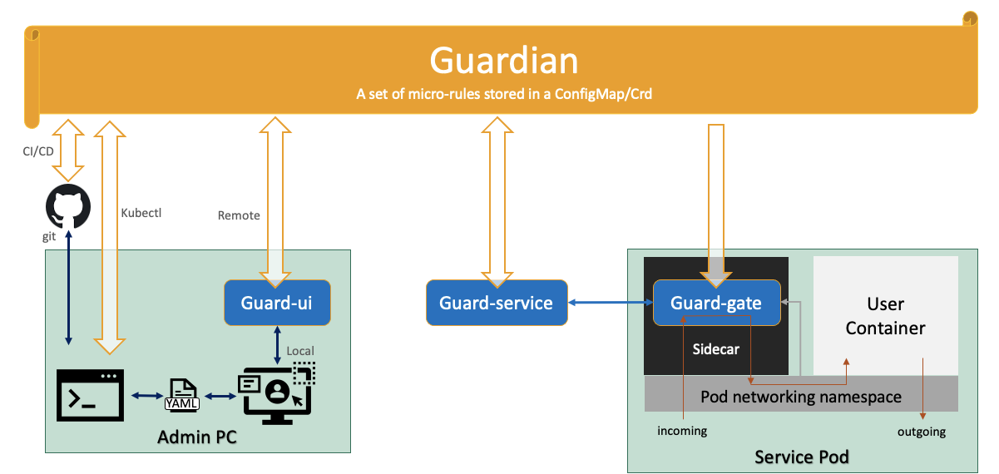

<h1> Security-Guard</h1>

Guard help secure microservices, serverless containers and serverless function. It detects and block exploits sent to services and can detect and restart compromised service pods.

This readme file offers general information about Guard. Guard can be used with vanilla Kubernetes. See [how to install and use Guard on Kubernetes](KUBERNETES.md). Guard is integrated into Knative, making it easier to use. See [how to install and use Guard on Knative](https://knative.dev/docs/serving/app-security/security-guard-about/).

The rest of this Readme apply to using Guard on any system.

## Why Do We Need Security-Guard?

User containers deployed on Kubernetes may include vulnerabilities, may be misconfigured and may include malicious code. The source of such vulnerabilities, misconfigurations or malicious code may be the DevOps team, a dependency or a hacker that has successfully penetrated any of the support systems (image repository, ci/cd, Knative, Kube, the DevOps team development systems etc. etc. etc.) or one of the backend services used by the user container. Any such security issue may enable an attacker to use the user container for other purposes than its original intention (e.g. steal data, attack others, spread, contact a C&C, Crypto mining, etc.)

Kubernetes users require the means to block (and/or get an alert about) an attempt to exploit a vulnerability or misconfiguration, embedded in a user container. Also, users require the means to establish situational awareness about container running potentially malicious code and be offered ways to respond once they discover that the user containers are being exploited by attackers.

## How Does Security-Guard Help Secure Kubernetes Services

The core component of Security-Guard, or Guard for short, is the [guard-gate](pkg/guard-gate). guard-gate is normally embedded in a sidecar to protect a pod offering a service. [guard-gate](pkg/guard-gate) monitors and potentially blocks client requests and/or responses to/from Kubernetes services based on a per-service security configuration.

The per service security configuration is stored in a **"Guardian"** object. **Guardian** maintains a set of micro-rules that enable fine grain filtering, performed against each value delivered to/from the service.
By using the micro-rules, [guard-gate](pkg/guard-gate) can identify the delivery of exploits targeting vulnerabilities embedded as part of the service or its dependencies.

When [guard-gate](pkg/guard-gate) and a proper set of micro-rules are used, offenders will typically be required to build dedicated delivery mechanisms in order to explore options for detecting and exploiting service vulnerabilities. This lengthy process may need to be repeated for each service, as each service maintains a different set of micro-rules. As a result, an offender will not be able to use common statistical attack patterns. Further, significant part of potential attacks are avoided and cannot be performed when protected by Guard. The exact ratio of attacks that are avoided altogether are for further study by the community.

Users of [guard-gate](pkg/guard-gate) gain Situational Awareness both thanks to alerts about out-of-pattern request/responses, and by the identification of pod related security indicators  - suggesting that the service is misused. Such pod related indicators include longer than usual  service times and the list of external IP addresses approached by the service.

[guard-gate](pkg/guard-gate) enables blocking out-of-pattern behaviors and the ability to react to potential attacks and/or to on-going attacks by introducing a fine-tune configurable security gate in front of the service.

Overall, the solution offers both visibility into the security of the service, and the ability to monitor/block both known patterns and unknown patterns (using unknown exploits aimed at unknown vulnerabilities).

    

## Solution Components

This project includes:

1. [guard-gate](pkg/guard-gate) - the workload security gate that is located in front of each service
1. A **Guardian**  - an object implemented as either a CRD or a Configmap maintaining a set of micro-rules per service
1. [guard-service](cmd/guard-service) - a learner service to auto learn the micro-rules stored in the **Guardian**
1. [guard-ui](cmd/guard-ui) - a user interface web app to simplify manual configuration of micro-rules

In addition, the project includes:

1. [qpoption](pkg/qpoption) - a package to enable using [guard-gate](pkg/guard-gate) with Knative Queue Proxy Option
1. [test-gate](pkg/test-gate) - a package to enable testing Knative Queue Proxy Options named
1. [pluginterfaces](pkg/pluginterfaces) - a base package to enable registration and interfacing security gates

See [Guard Architecture](ARCHITECTURE.md) to learn about how Guard process and learn internally security data.

## Guard Gate

[guard-gate](pkg/guard-gate) can be loaded as a knative queue proxy option using [qpoption](pkg/qpoption)

Once loaded, it monitors the proxied requests and responses and the pod network.

## Guardian

[guard-gate](pkg/guard-gate) uses **Guardian** - a set of micro-rules that define the expected behavior of the service.

The **Guardian** object maintains the following configuration parameters:

1. A control object which defines the working mode of Guard in relation to the service
1. A learned set of micro-rules updated by [guard-service](cmd/guard-service)
1. A manually configured set of micro-rules that can be updated using `kubectl` or using [guard-ui](cmd/guard-ui)  

Each service has its own respective **Guardian**. New services may use a default **Guardian** for the Kubernetes namespace or may use the default Guard **Guardian**. The following procedure describes how the **Guardian** for service `servicename` in namespace `namespace` is found. Note that [guard-gate](pkg/guard-gate) may be configured to either work with CRDs (guardians.guard.security.knative.dev) or with Configmaps `guardian-*` as **Guardians**.

When looking for a service **Guardian**:

- A **Dedicated-Guardian** per service is used (CRD named `<servicename>` or Configmap named `guardian-<servicename>`).
- If the **Dedicated-Guardian** is not found, a **Namespace-Default -Guardian** is used as a starting point (CRD named `ns-<namespace>` or Configmap named `guardian-ns-<namespace>`).
- If a **Namespace-Default-Guardian** is not found, a **Default-Guardian** is used as a starting point.
- Note that the **Default-Guardian** uses auto-learning to help bootstrap new **Guardians**.

See [guard-gate](pkg/guard-gate) for more details on the different Guard working modes..

## Guard Service

[guard-service](cmd/guard-service) is a standalone service used to learn **Guardian** micro-rules based on inputs from instances of [guard-gate](pkg/guard-gate). [guard-service](cmd/guard-service) stores the **Guardian** as a CRD (guardians.guard.security.knative.dev) under the name `<servicename>` or in a Configmap under the name `guardian-<servicename>`.

Additionally, [guard-service](cmd/guard-service) cache Guardians and serve [guard-gate](pkg/guard-gate) requests to get a copy of the Guardian. This is done to reduce the load on KubeApi since any deployed Knative pod requires to access a copy of the Guardian on startup.

[guard-service](cmd/guard-service) also serve as a central service for all alerts found by all services.

Last, [guard-service](cmd/guard-service) may accept an indication from a [guard-gate](pkg/guard-gate) that the Pod is compromised and will restart the Pod consequently.

### Learning policy for guard-gates

Sync with guard-service if any of the following occur:

- If we aggregated 1000 samples or more
- If we aggregated 1000 alerts
- One minute passed (or as defined in GURDIAN_SYNC_INTERVAL env variable):
  - And we aggregated 10% or more of all samples learned so far
  - Or that we have alerts
- 5 minutes passed (or 5 times what is defined in GURDIAN_SYNC_INTERVAL env variable)

Notes:

- During normal operation, we avoid syncing with guard-service if we already synced in the last 5 seconds.
- During guard-gate Shutdown(), after all sessions and all services were closed, if we have samples or alerts we enforce a sync before we terminate.

### Learning and persisting policy for guard-service

When a sync message arrives from a guard-gate, we first merge the pile to the guard-service maintained pile;
Then, if we have no learned criteria in guardian for this service, we create one and persist the guardian.

If we already have a guardian with a learned critiria:

- We learn and update the critiria if
  - We have more than 1000 new samples accumulated from guard-gates
  - We have more than 10% new samples from all samples learned
  - 30 seconds passed since we last learned

We persist the guardian if 5 min passed since we last persisted it and we have an updated the critiria that was learned.

## Guard User Interface

Although **Guardian** CRDs and Configmaps can be controlled directly via `kubectl`, an optional [guard-ui](cmd/guard-ui) is offered to simplify and clarify the micro-rules.

## Summary

Guard takes a zero-trust approach. Guard assumes that all services are most likely vulnerable and places a gate in front of every service to monitor client interactions and block exploit delivery. By doing so, Guard implements a zero-trust architecture. At the same time, guard monitors each service Pod, offering further protection on a Pod level basis.

## License
