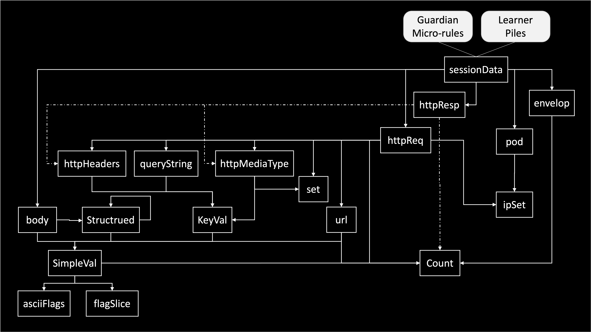

# Security Data Package

This package serves as the beating heart of Guard.

It defines dataType structures used across Guard. The dataType are listed below.

## The wsecurity/v1alpha1 API

The [v1alpha1 interface](v1alpha1.go) includes three interfaces:

- **ValueProfile**: used by classes describing a sample of a given data type
- **ValuePile**: used by classes accumulating multiple profiles of a given data type to enable learning.
- **ValueConfig**: used by classes describing micro-rules for a given data type.

Each dataType implements three classes, each conforming to an interface. For example, the SimpleVal dataType have three main classes:

- The **SimpleValProfile** class - to profile simple string value (conforms to the **ValueProfile** interface)
- The **SimpleValPile** class - to pile such profiles for later learning  (conforms to the **ValuePile** interface)
- The **SimpleValConfig** - to maintain micro-rules for s simple string value  (conforms to the **ValueConfig** interface)

The class interface is used for both articulating the expectations from each dataType as far as exported methods and to enable a central testing facility for all dataTypes.
The interface includes a set of generic un-exported methods, implementing such methods by a dataTypes requires that the implementation perform runtime type assertions.
The **ValuePile** interface requires for example:

```golang
    func (pile *ValuePile) addI(profile ValueProfile)
    func (pile *ValuePile) mergeI(pile ValuePile)
```

The **SimpleValPile** class since conforms to **ValuePile** and therefore includes un-exported methods such as:

```golang
    func (pile *SimpleValPile) addI(profile ValueProfile)
    func (pile *SimpleValPile) mergeI(pile ValuePile)
```

Apart from conforming to the interface, each dataType implements its own specific exported version of each generic interface method.
For example, the **SimpleValPile** class exports the following methods:

```golang
    func (pile *SimpleValPile) Add(profile *SimpleValProfile)
    func (pile *SimpleValPile) Merge(pile *SimpleValPile)
```

These exported methods are tested using their un-exported method counterparts.
The un-exported method are therefore wired internally to the exported ones.
This pattern repeats for the three classes of all dataTypes.

## DataTypes

<p align="center">
    
</p>

Guard manages its data based on a group of dataTypes. Each dataType can profile data, pile the profiles and maintain micro-rules. The micro-rules can be learned from piles or set manually. Micro-rules enable deciding if a current profile meets some criteria that was learned or manually configured.

### Count DataType

This dataType is used to profile, learn and create micro-rules for a something countable at the range of 0-255.
Anything beyond 255 is considered as 255.

### Set DataType

This dataType is used to profile, learn and create micro-rules for a set of strings.

### IpSet DataType

This dataType is used to profile, learn and create micro-rules for a set of IPs. The micro-rules uses CIDRs to maintain ranges of IPs

### Envelop DataType

This dataType is used to profile, learn and create micro-rules for enveloping information about the session including the time it takes for a response to be sent and the time it takes for the session to end.

### AsciiFlags DataType

This dataType is used to profile, learn and create micro-rules for identifing the use of specialChar characters.

### FlagsSlice DataType

This dataType is used to profile, learn and create micro-rules for a a large set of flags and is currently used for maintaining which unicode blocks are used.

### SimpleVal DataType

This dataType is used to profile, learn and create micro-rules for a simple string that can take any value. SimpleVal uses Count
to count the number of digit, letters, specialChars, unicodes, spaces, nonReadables and sequences, it uses AsciiFlags to identify the use of all specialChar characters and flagsSlice to identify all unicode blocks used.

### KeyVal DataType

This dataType is used to profile, learn and create micro-rules for a map of strings keys to SimpleVal. It is used for request/response headers, query string etc.

### URL DataType

This dataType is used to profile, learn and create micro-rules for the http URL.

### HttpHeaders DataType

This dataType is used to profile, learn and create micro-rules for the http http headers.

### QuerySTring DataType

This dataType is used to profile, learn and create micro-rules for the http query string.

### HttpMediaType DataType

This dataType is used to profile, learn and create micro-rules for the http media type.

### Structured DataType

This dataType is used to profile, learn and create micro-rules for a data which is structured (json data or http form data)

### Body DataType

This dataType is used to profile, learn and create micro-rules for the http request and response body.

### HttpReq DataType

This dataType is used to profile, learn and create micro-rules for the http request structure (without body).

### HttpResp DataType

This dataType is used to profile, learn and create micro-rules for the http response structure (without body).

### Pod DataType

This dataType is used to profile, learn and create micro-rules for POD data.

### SessionData DataType

This dataType is used to profile, learn and create micro-rules for the http the entire session data including the request, response, request body, response body, envelop and pod.

## Guardian

The Guardian is a data structure which mainatins all micro-rules and controls the different working modes of the security-guard.

## Piles

Piles gathered by security-guard are propogated if needed to the guard-learner where they are merged with piles from other instances of security-guard to later assist in the formation of the Guardian.

## Core Activity

Per Sample:

1. Profile.Profile(...sample...) - Create a profile from the sample
1. Config.Decide(profile)  - Decide if it conforms to the micro-rules
1. Pile.Add(profile)  - Add it to a pile.

Periodically:

1. Pile.Merge(someOtherPile) - Merge someOtherPile to Pile.
1. Config.Learn(pile) - Learn new micro-rules based on a pile.  
1. Config.Fuse(someOtherConfig) - Fuse configs to form a new set of micro-rules from two sets.

Notes:

- Profiles, Piles and Configs are build to be transportable across a distributed system.
- Piles consume Profiles using Add()
  - Once a profile is added to Pile it is no longer usable.
- Piles consume other piles using Merge()
  - Once a pile is merged to another pile the merged pile is no longer usable.
- Configs consume piles using Learn()
  - Once a pile is learned by a config, the pile is no longer usable.
- Configs consume other configs using Fuse()
  - Once a config is fused to another config, the fused config is no longer usable.

## Distributed System

Guard supports working in a distributed system by allowing many instances to collect samples and take decisions.

The instances each collect piles and send them to a central service that merge the piles and learn a new config based on the enw piles and the old config.

The config is then sent back to the instances and is kept in a persistent store.
