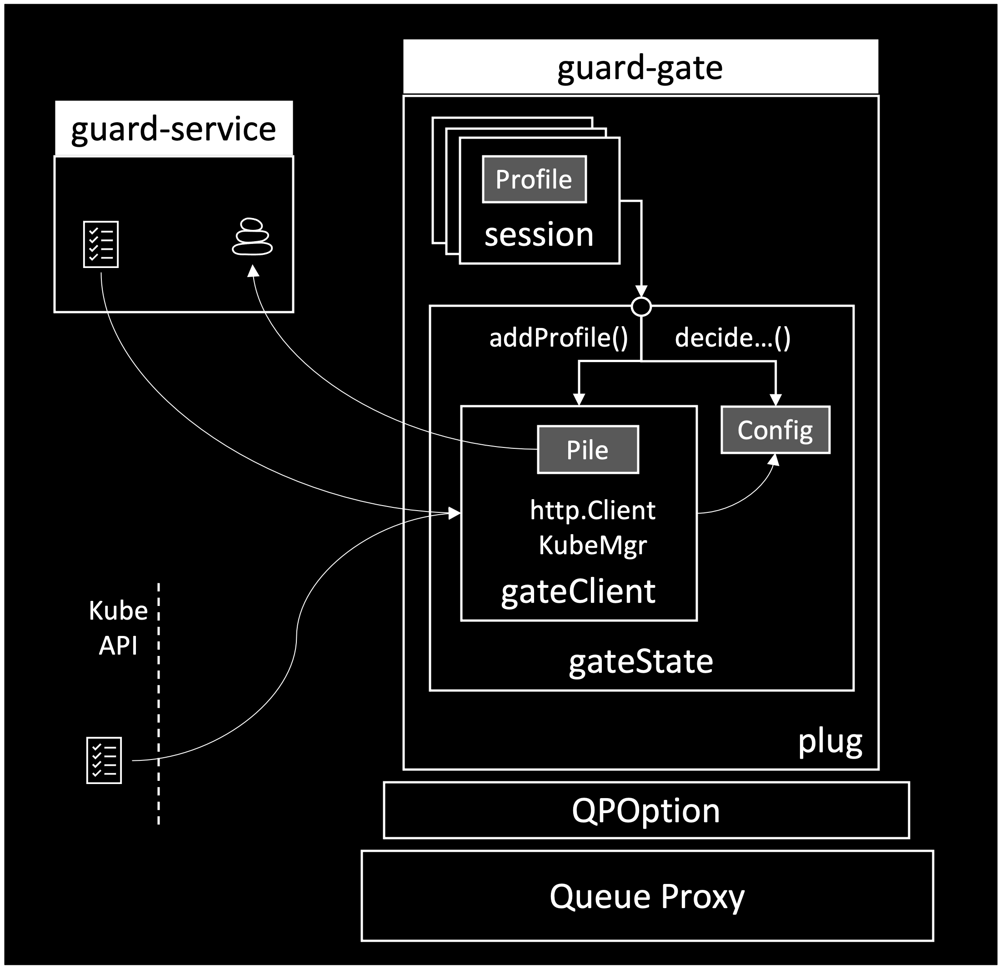

# Guard Gate

guard-gate is a go package that can be attached to a go reverse proxy in order to extract profiles about requests, responses and the pod it is running at.

Each profile is compared to the criteria defined in the Guardian allowing the guard-gate to alert about misbehavior or block misbehavers.

Additionally, profiles are piled together and sent to the [guard-service](../../cmd/guard-service/README.md) to enable it to learn new Guardians.

To access Guardians, guard-gate uses either the [guard-service](../../cmd/guard-service/README.md) or the [guard-kubemgr](../guard-kubemgr/README.md) package.

The below diagram captures the SW architecture for the guard-gate plug.

    

The gate-state maintains the information extracted using the gateClient from either the guard-service or KubeApi.
Every session profiles the session data as it becomes available and asks the gate-state to decide is the profile should raise an alert or not.
When the entire profile is ready, the session sends it to the gate-state which forwards it to the gateClient so it can be added to the pile.

The plug code manages the entire process and maintains a mainLoop for the gate which triggers periodical pile flushing to service, periodical config reloading and periodical pod monitoring. All three actions are performed by the gate-state. When a new request or response arrives, the plug code engage the coresponding session and provide it with the request or response data.

sessions, also maintain a sessionLoop which triggers periodical profiling of the session envelop and copy the current pod profile to the overall session profile.

For a more global understanding of how guard works, see [Guard Architecture](/ARCHITECTURE.md) to learn about how Guard process and learn internally security data.
